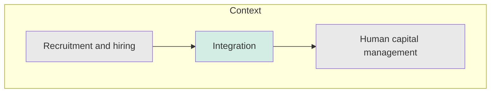
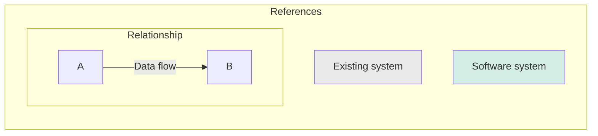

# Integración 'Reclutamiento y selección'

## Objetivo
> Facilitar la sincronización entre el sistema de 'Reclutamiento y Selección' y el sistema para la gestión de capital humano

| Nombre      | Descripción |
| ----------- | ----------- |
| Recruitment and hiring | Sistema de software cuyo objetivo es facilitar y optimizar los procesos relacionados con la adquisición de talento en una organización. Sus funciones abarcan desde la publicación de ofertas de trabajo hasta la selección y contratación de candidatos. |
| Human capital management | Sistema de software que se centra en la administración integral de las personas dentro de una organización. Busca optimizar la gestión de colaboradores desde su incorporación hasta su desarrollo y eventual retiro. |