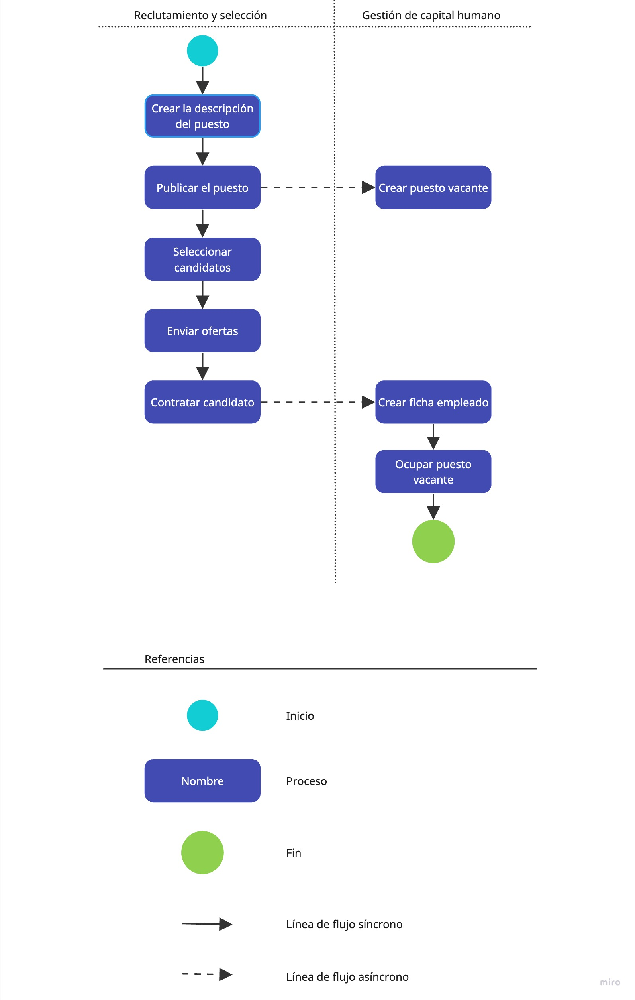

# ADR #3 - Integración del sistema de gestión de capital humano

Status: Approved

## Context
La necesidad de integrar dos sistemas independientes con el objetivo de mejorar la interoperabilidad y la eficiencia operativa.

> La integración se ejecuta asíncronamente ante la publicación de puestos de trabajo y ante la contratación de un candidato.

## Options
1. **Integración de Base de Datos:** Utilizar una base de datos compartida como punto de integración entre los dos sistemas.
2. **Integración de Archivos Planos:** Emplear la integración a través de archivos planos para facilitar la transferencia de datos.
3. **Arquitectura Basada en Eventos y Mensajería:** Adoptar la Arquitectura Basada en Eventos (EDA) junto con patrones de mensajería asincrónica para facilitar la comunicación entre los sistemas.

## Decision
Se decide adoptar la **Arquitectura Basada en Eventos y Mensajería** para la integración de los sistemas independientes.

## Consequences

### Pros
- **Desacoplamiento Efectivo:** La EDA permite un desacoplamiento significativo entre los sistemas, reduciendo las dependencias y facilitando futuras expansiones o modificaciones.
- **Escalabilidad:** La mensajería asincrónica y la EDA ofrecen una arquitectura altamente escalable, crucial para manejar cargas variables y futuros crecimientos de los sistemas.
- **Confiabilidad:** La implementación de patrones de mensajería asincrónica y EDA mejora la confiabilidad al mitigar los puntos únicos de falla y permitir la recuperación eficiente de fallos en los subsistemas.
- **Reactividad:** La arquitectura basada en eventos permite una respuesta rápida a cambios en los sistemas, manteniendo la sincronización entre los sistemas independientes.

### Cons
- **Curva de Aprendizaje:** Se requerirá capacitación para que el equipo comprenda y adopte los principios de la Arquitectura Basada en Eventos y la mensajería.
- **Infraestructura Adicional:** Será necesario implementar y mantener infraestructura específica para la mensajería y la gestión de eventos.

### References
* Architectural Patterns, Anupama Murali, Harihara Subramanian J, Pethuru Raj Chelliah
